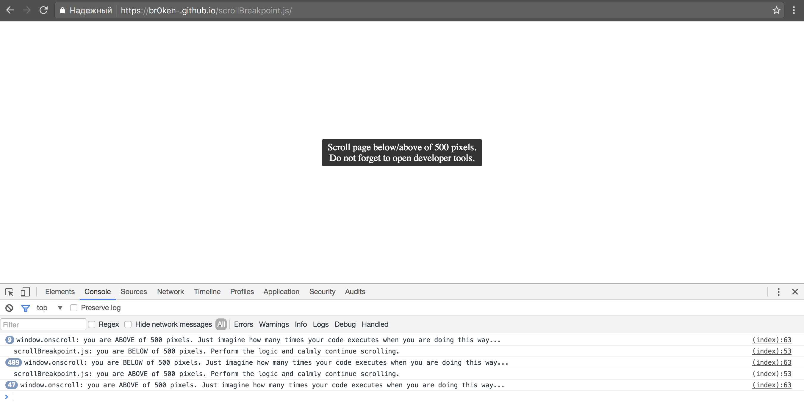

# conditional-breakpoint.js

Reduce handling overhead of the `scroll` and `resize` events by triggering a handler only once on passing a breakpoint.

## Browsers support

Every browser that has `window.addEventListener()` is supported (IE9+).

## Installation

### Bower

```shell
bower install conditional-breakpoint
```

### NPM

```shell
npm install conditional-breakpoint
```

## Usage

Let's add the `sticky-header` class to the `body` element as soon as the scroll position > 500 pixels and remove it otherwise.

```javascript
window.conditionalBreakpoint.scroll(
  () => window.scrollY > 500,
  // This fn is called when the boolean of the above callback changes.
  (isTrue) => document.body.classList[isTrue ? 'add' : 'remove']('sticky-header'),
);
```

> [!TIP]
> The `window.conditionalBreakpoint.resize()` is also available with the exact same calling signature.

**Use the above** instead of this:

```javascript
window.addEventListener(
  'scroll',
  // This fn is called on every scroll movement.
  () => document.body.classList[this.scrollY > 500 ? 'add' : 'remove']('sticky-header'),
);
```

Two examples above technically do the same job however the first one runs a handler only on reaching a condition and then waits for it to change to run again. This allows separating the handling logic from a condition check to gain some performance. Contrary, the standard event handler do a condition check and run the logic on every event occurrence.

[Check out the demo](http://BR0kEN-.github.io/conditional-breakpoint.js)


